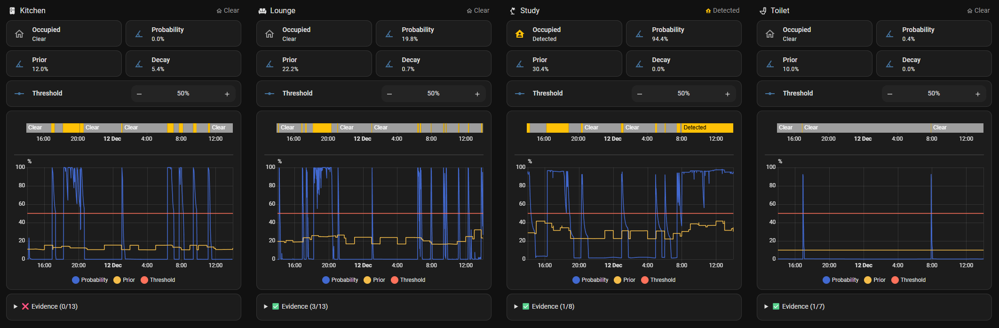

# Area Occupancy Detection for Home Assistant


[](https://github.com/Hankanman/Area-Occupancy-Detection/releases)
[](https://analytics.home-assistant.io/custom_integrations.json)


[](https://buymeacoffee.com/sebburrell)

Have you ever had your lights turn off while you're still in the room? Or watched your smart home mark you as "away" while you're sitting perfectly still, watching TV? These frustrating experiences happen because most occupancy detection relies on simple motion sensors that can't understand context.

**Area Occupancy Detection** solves these real-world problems by thinking more intelligently about what "occupied" really means. Instead of just checking if motion was detected, it combines multiple clues, learns from your patterns, and calculates the probability that someone is actually there.

**Replace Dozens of Templates and Groups** it provides the intelligent occupancy information you need to create reliable automations. AOD creates sensors that your automations can use to control lights, heating, and other devices. Without AOD this means setting up lots of groups, template sensors and jinja logic, with AOD you just give it all the entities and it creates reliable entities for you.



## The Quick Answer

**Here's why AOD is different:**

| HA                                             | AOD                                                                                                                                           |
| ---------------------------------------------- | --------------------------------------------------------------------------------------------------------------------------------------------- |
| Motion On. Occupied. Motion Off. Not occupied. | Checks motion, TV, doors, appliances, history, time of day... 75% confident someone is there.                                                 |
| No Learning                                    | Learns from your history automatically. Gets smarter over time. Knows you're usually in the kitchen Sunday mornings.                          |
| One sensor fails → wrong answer.               | Combines multiple sensors intelligently. If motion misses you, TV being on maintains occupancy probability → your automations keep lights on. |
| Needs automation timeouts to keep lights on    | Motion stops → probability gradually decreases → occupancy sensor stays on longer → your automations keep lights on while you sit still.      |
| No Native Activity Detection                   | Activity detection (what's happening), sleep presence tracking, "Wasp in Box" for bathrooms, whole-home aggregation, purpose-based defaults.  |

## Creating Automations with AOD

Here's how AOD fits into your automation workflow:

### The Workflow

1. **AOD analyzes your sensors** → Motion, TV, doors, appliances, learned patterns
2. **AOD calculates probability** → Combines all inputs using Bayesian inference
3. **AOD creates occupancy sensors** → Binary occupancy status and probability sensors
4. **Your automations use these sensors** → Trigger actions based on occupancy state or probability
5. **AOD learns and adapts** → Gets smarter over time, improving your automations automatically

### What AOD Provides

AOD creates sensors that your automations can use:

- **Occupancy Status**: Binary sensor (`on` = occupied, `off` = clear) - use this in most automations
- **Occupancy Probability**: Percentage (1-99%) - use this for conditional or gradual actions
- **Detected Activity**: What's happening in the room (showering, cooking, watching TV, sleeping, etc.) - use for context-aware automations
- **Sleeping**: Whether people are sleeping in the area - use for overnight occupancy
- **Presence Confidence / Environmental Confidence**: Split view of what's driving the probability
- **Prior Probability**: Baseline from learned patterns - useful for monitoring and debugging
- **Threshold**: Adjustable setting - fine-tune without reconfiguration


### How You Use It

You create automations that respond to AOD's sensors. For example:

- **Turn lights on** when occupancy status turns `on`
- **Turn lights off** when occupancy status turns `off`
- **Adjust heating** based on occupancy probability
- **Dim lights gradually** as probability decreases

The key difference: AOD provides intelligent occupancy data. You decide what actions to take based on that data.

## Documentation

AOD is extensively documented [here](https://hankanman.github.io/Area-Occupancy-Detection/).

## Features

- **Bayesian Occupancy Detection**: Combines multiple sensor inputs using Bayesian probability for accurate occupancy detection.
- **Dual-Model Approach**: Separates presence indicators (motion, media, appliances, doors, windows, covers, power, sleep) from environmental support (temperature, humidity, CO2, etc.). Presence sets the probability; environmental readings adjust it, damped to 20% influence.
- **Multiple Sensor Support**:
  - **Motion/Occupancy Sensors**: Primary input and ground truth for detecting presence.
  - **Media Devices**: TV, media players, and similar devices as activity indicators.
  - **Appliances**: Switches or sensors representing devices like fans, PCs, or other appliances.
  - **Cover Sensors**: Blinds, shades, shutters, and garage doors being operated.
  - **Environmental Sensors**: Temperature, humidity, illuminance, CO2, sound pressure, atmospheric pressure, air quality, VOC, PM2.5, and PM10 sensors contribute subtle occupancy clues.
  - **Doors and Windows**: Entry/exit and ventilation patterns.
  - **Power Sensors**: Power consumption as an activity indicator.
- **Activity Detection**: Identifies what activity is happening in a room (showering, cooking, watching TV, working, sleeping, eating, etc.) — constrained by room purpose so "showering" only appears in bathrooms.
- **Sleep Presence Detection**: Detects when people are sleeping using HA Person entities combined with phone sleep confidence from the Companion App, keeping bedrooms occupied overnight.
- **Probability-Based Output**: Provides an occupancy probability (1-99%) and a binary occupancy status based on a configurable threshold.
- **Time-Based Priors**: Learns occupancy patterns by **day of week** and **time of day**, adjusting probability dynamically based on historical usage.
- **Adaptive Historical Analysis**: Learns sensor reliability and priors over time, improving accuracy as it gathers data.
- **Probability Decay**: Gradually reduces occupancy probability when no new activity occurs, with purpose-based defaults.
- **Wasp in Box**: Virtual sensor for rooms with a single entry/exit point — maintains occupancy when the door closes after motion.
- **Adjacent Areas**: Learns transition patterns between physically-connected rooms, boosting a neighbour's probability when household movement suggests it's next and slowing decay when the only known exit has stayed quiet.
- **All Areas Aggregation**: Automatically creates aggregated entities across all configured areas for whole-home occupancy detection.
- **Real-Time Threshold Adjustment**: Modify the occupancy threshold without reconfiguration.
- **Weighted Sensor Contributions**: Fine-tune how much each sensor type influences the final probability.
- **Purpose-Based Defaults**: Selecting a room purpose (12 options from Passageway to Bedroom) automatically sets sensible decay timing.

## Planned Features

- **Machine Learning Model**: Train a neural network based on history to complement the existing Bayesian approach for improved predictions.
- **Auto-Adjusting Threshold**: Based on history and predictions, automatically adjust the threshold so the user doesn't need to.
- **Location Aware**: Leveraging BLE, WiFi, GPS.
- **Weather-Aware**: Integrate weather data into priors (cold and rainy → more likely to be indoors).
- **Occupancy Zone Hierarchies**:
  - **Parent-Child Area Relationships**: Hierarchical zones (floor → room) whose occupancy aggregates and cascades — beyond the peer-to-peer influence that [Adjacent Areas](https://hankanman.github.io/Area-Occupancy-Detection/features/adjacent-areas/) now provides.
  - **Multi-Room Tracking**: Track movement across rooms for more continuous occupancy detection.

## Installation

## HACS

[](https://my.home-assistant.io/redirect/hacs_repository/?owner=Hankanman&repository=Area-Occupancy-Detection&category=integration)

1. **Ensure HACS is installed:** If you don't have the [Home Assistant Community Store (HACS)](https://hacs.xyz/) installed, follow their instructions to set it up first.
2. **Navigate to HACS:** Open your Home Assistant frontend and go to HACS in the sidebar.
3. **Search for Area Occupancy Detection:** Search for "Area Occupancy Detection" and select then **Download**.
4. **Restart Home Assistant:** After the download is complete, restart your Home Assistant instance

When you first create the integration you will be taken straight to configuring the first area.

When adding new areas you will need to navigate to **Integrations** -> **Area Occupancy Detection** -> **Configure (⚙️ Cog icon)**. This will bring up the configuration menu.

There is detailed documentation on the configuration options here: [Configuration](https://hankanman.github.io/Area-Occupancy-Detection/getting-started/configuration/).

For an ideal setup you will need to perform these steps in Home Assistant before setting up the integration:

- Set up Home Assistant Areas, [see here to set up areas](https://www.home-assistant.io/docs/organizing/areas/)
- Set up Home Assistant Floors, [see here to set up floors](https://www.home-assistant.io/docs/organizing/floors/)
- Set up Home Assistant People, [see here to set up people](https://www.home-assistant.io/integrations/person/)

Almost every option in the config is optional, sensible defaults are available for eveything. The minimum configuration for an area is:

- A Home Assistant Area. Must exist in Home Assistant first, [see here to set up areas](https://www.home-assistant.io/docs/organizing/areas/)
- A Purpose. What the room is used for, [see more about purposes here](https://hankanman.github.io/Area-Occupancy-Detection/features/purpose/)
- 1 Motion sensor. A physical device in the area like PIR, mmWave

The integration will work with just these configured. Everything else can be added as you get new devices. However the more you add in, the more accurate the predictions will be.

## Entities Created

The integration creates entities for each configured area. An "All Areas" aggregation device is also created automatically. See the [Entities documentation](https://hankanman.github.io/Area-Occupancy-Detection/features/entities/) for full details.

## Debugging

Enable debug logging in `configuration.yaml`:

```yaml
logger:
  default: info
  logs:
    custom_components.area_occupancy: debug
```

Key things to check in the logs:

- Sensor state changes.
- Probability calculations.
- Prior probability updates (including time-based priors).
- Decay calculations.

## Support & Feedback

- **Issues**: [GitHub Issues][issues]
- **Discussions**: [Community Discussion][community]
- **Releases & Changelog**: [GitHub Releases][releases]

If you enjoy the integration, please consider buying me a coffee!

[](https://buymeacoffee.com/sebburrell)

[issues]: https://github.com/Hankanman/Area-Occupancy-Detection/issues
[community]: https://github.com/Hankanman/Area-Occupancy-Detection/discussions
[releases]: https://github.com/Hankanman/Area-Occupancy-Detection/releases
